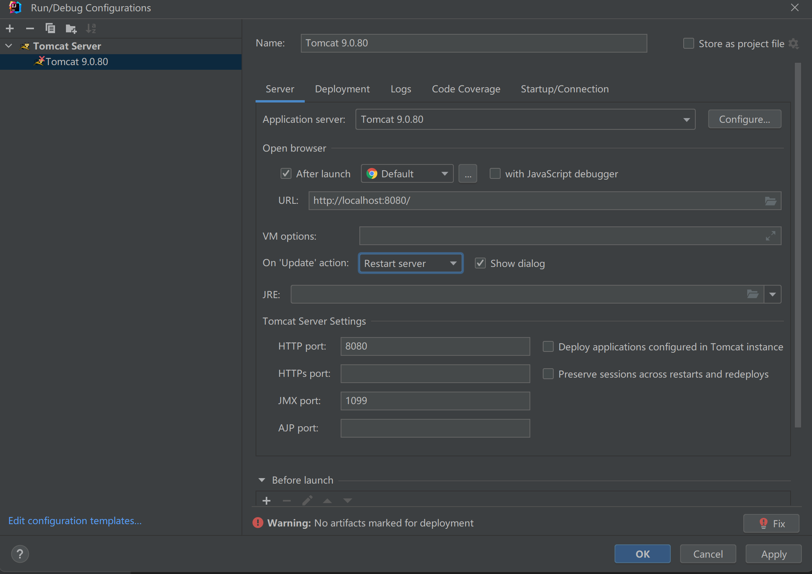
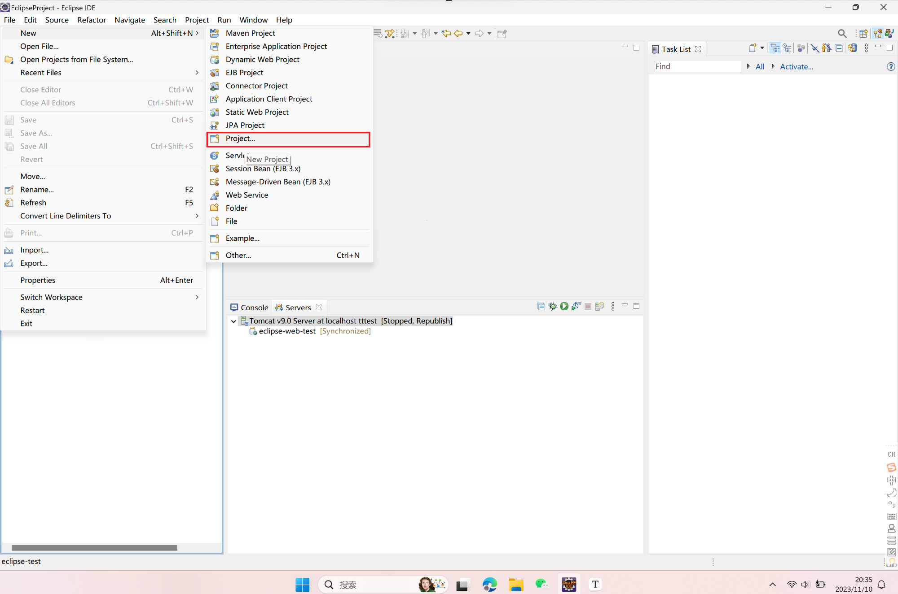
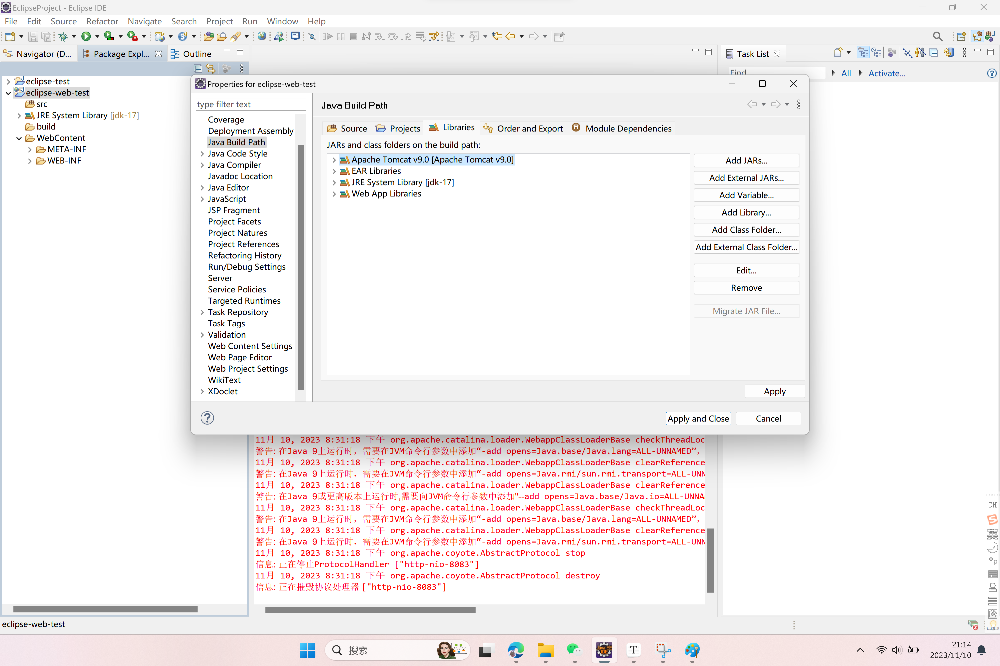
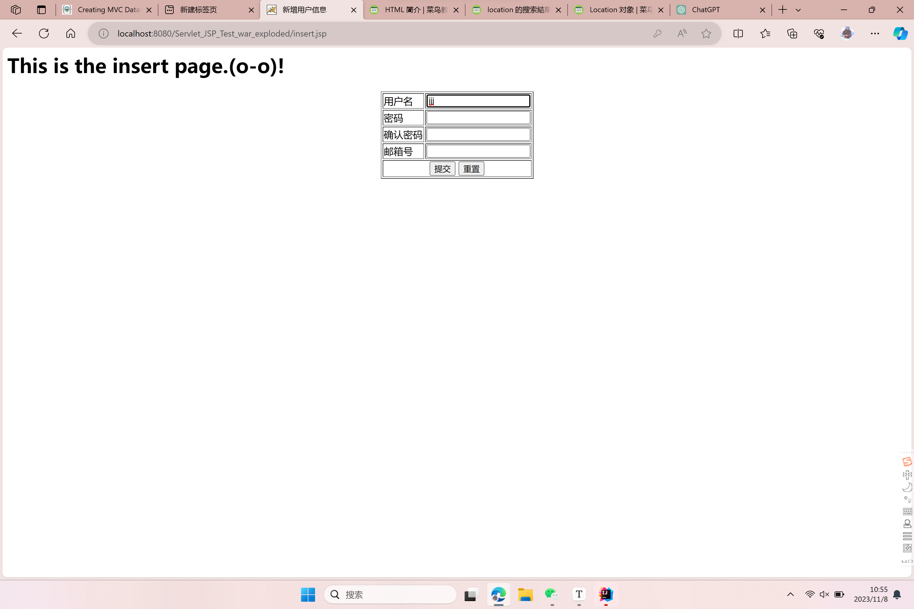

# JavaWeb开发——实现对数据库中表的增、删、改、查

一个我自己在实现 javaweb 应用过程中的心得，从环境配置、基础知识学习和一个实例的具体实现说起......

## 环境配置

- JDK安装

  - Java开发工具包（Java Development Kit），它是Java平台的核心开发工具集，用于开发、编译、调试和运行Java应用程序和应用程序组件。

  - 版本选择：徐老师推荐的是JDK8（我由于之前配置过JDK就没有重新安装了，我的版本是JDK17，但建议大家还是下载jdk8）

  - 涉及到的一些环境变量啥的自己可以去各种渠道搜索~

    

- tomcat服务器

  - 是一个开源的Java Servlet容器和JavaServer Pages (JSP)容器，它充当了Java Web应用程序的运行环境。

  - [Apache Tomcat官网](https://tomcat.apache.org/)下载tomcat服务器

  - 版本选择（我下载版本的是9.0.80）

    

    

- IDE安装

  - eclipse

    - 版本选择：我下载的版本是4.16

  - IntelliJ IDEA

    - 版本选择：我下载的版本是2022.1.3

      

- 如何新建一个javaweb项目，并启动

  - IntelliJ IDEA 2022.1.3 的方法：

    1. **New Project，**并**配置好自己下载的相应版本的 JDK**

       

    2. 右键自己的项目，为自己的项目**Add Framework Support**

       

    3. 选择 **Web Application**，并点击OK：

       

    4. 可见此时项目中多了一个 web 文件夹，里面会嵌套一个 WEB-INF 文件夹存放配置信息和 index.jsp 页面文件：

       

    5. 然后，给项目**配置 tomcat 服务器**，提供 servlet 程序的运行环境，在 IDEA 中依次点击 **Run>Edit configuration>“+”号**：

       

    6. 在右边填写服务器名等配置信息：

       

    7. 在**“Deployment”**中选择 **Artifact** 打包方式，便于**将项目部署到服务器**上，然后点击OK：

       

       

    8. 最后启动 javaweb 项目：

       在右上角选择我的 Tomcat 9.0.80 服务器，然后点击绿色三角箭头标志即可启动我的 javaweb 项目，默认展示的是 web 文件夹下的 index.jsp 文件页面：

       

       index.jsp 的页面在浏览器展示如下：

       

  - eclipse 4.16 的方法

    1. 新建java ee项目，**左上角File>New>Project>选择Dynamic Web Project：**

       

       

       

       点击“Next”，**然后在如下页面设置web项目的名称和web module的版本**，这里我的名称设置的是“eclipse-web-test”，Dynamic web module version版本设置的是4.0：

       

       然后继续“Next”：

       

       继续“Next”，然后在如下页面”Finish“：

       

       此时，导航栏中已经出现了我的“eclipse-web-test”项目：

       

       可见，项目的结构和之前使用IDEA所创建的项目结构是一致的，只是web文件夹改成了WebContent文件夹而已。

    2. **给全局配置 JDK：**

       **菜单栏 Window > Preferences > Java > Installed JREs **到如下页面，然后 **Add** 自己的 JDK（点完 Add 之后选择 Standard VM，然后 JDK HOME 选择自己的 JDK 路径就好，我的是JDK-17）：

       

    3. **配置 tomcat 服务器：**

       **菜单栏 Window > Preferences > Server > Runtime Environment** 在如下页面 **Add** 自己下载好的 tomcat 服务器，版本选择你自己服务器下载的版本就好，比如我的 tomcat 是9.0.80，我选择的就是 Apache Tomcat v9.0：

       

    4. 给**当前项目**配置 JDK 和添加 Tomcat 服务器：

       注意区分这一步与 2、3 步之间的区别。

       **右键项目文件夹 > Properties > Java Build Path > Libraries** 到如下界面：

       

       **删除（Remove）自带的 JRE System Library[xxxx]，**然后点击 **Add Library** 到如下界面：

       

       **添加自己的 JRE System Library 和服务器 Server Runtime：**

       

       然后点击"Finish"，再"Apply" ：

       

       此时，项目左侧的 JRE System Library 后面 [] 中也从最初的 JavaSE-1.8 变成了你自己下载的 JDK 版本（我这里是 JDK-17），当前项目的 JDK 和服务器已经配置完毕。

    5. 在 WebContent 页面下新建一个 NewFile.jsp 文件，并修改字符集为"UTF-8"：

       

    6. 最后，点击菜单栏上的**绿色箭头按钮**，点击 Run On Server 选择服务器并运行我们的web应用：

       

       **此时可能会报错，说没有 Servers 这个目录，如果报错，我们可以点击菜单栏的 Window > Show View > Servers 可以解决这个问题~**

       NewFile.jsp 文件的内容呈现如下：

       

       

## 基础知识学习

我们需要首先学习一些前置知识，可以去[菜鸟教程 ](https://www.runoob.com/)上迅速学习这些基础的知识：

- HTML
  - 网页的结构与内容
- CSS
  - 网页的样式与外观
- JavaScript
  - 一种脚本语言，可以在网页上实现交互性和动态功能
- JSP(Java Server Page)
  - html和java结合，在网页中嵌入java代码
  - 生成网页的动态内容


## 一个实例的生成

基于**MVC设计模式**实现的一个对数据库中**t_user表**实现**增、删、改、查**的web应用，其中：

- **web 文件夹**放置页面（jsp）
- **src 文件夹**放置其它源码，如实体类（entity）、控制器程序（servlet）、与数据库交互的方法（dao）、其它工具类程序（util）等。
  - 注意，我这里命名不是很好，一般来说包是使用域名反转的形式来命名的，比如com.example.entity这样，可以再查阅相关资料改一改，看起来更规范一点~
- 整体项目结构如下：


- 表的建立和数据的导入

  - 可以根据各个组的实际设计需求自行定义、导入，注意一下完整性约束条件的设计等。

  - 我的表名：t_user，表中数据内容如下：

    

    

- **<u>View部分</u>**

  - 这部分代码在整个项目的==**web文件夹内**==

  - web应用的“门面”，web应用的界面就是由这部分来展示的。

  - 为了看懂这部分的代码，需要了解：

    - html
    - css
    - javascript
    - jsp

  - 思考，我们为了实现对t_user表进行增、删、改、查，需要哪些页面呢？

    - “查”：全体用户信息的查询页面 —— selectAll.jsp
    - “删”：在全体用户信息界面增加一个**用户信息删除按钮** 
    - “改”：用户信息修改页面 —— update.jsp
    - “增”：新增用户信息页面 —— insert.jsp

    下面，给出每个页面的具体实现jsp代码，其中，页面的内容是由`<body></body>`标签内的内容决定的：

  - “查“——selectAll.jsp

    ```html
    <%@ page contentType="text/html;charset=UTF-8" language="java" %>
    <%--使用jstl核心标签库--%>
    <%@ taglib prefix="c" uri="http://java.sun.com/jsp/jstl/core" %>
    <html>
    <head>
        <title>现实全部用户信息数据</title>
        <script>
            function confirmDeleteById(id){
                if(confirm("确定要将该用户的信息删除吗？")){
                    // 把url换成/delete
                    location.href = 'delete?id=' + id;
                }
            }
        </script>
        <style>
            div{
                text-align: center;
            }
        </style>
    </head>
    
    <body>
    <h1>This is the information page of all users.</h1>
    
    <div>
        <table align="center" border="10">
            <tr>
                <td>ID号</td>
                <td>用户名</td>
                <td>密码</td>
                <td>邮箱号</td>
                <td>操作</td>
            </tr>
            <c:forEach items="${usersList}" var="u"> 
                <tr>
                    <td>${u.id}</td>
                    <td>${u.username}</td>
                    <td>${u.password}</td>
                    <td>${u.email}</td>
                    <td>
                        <a href="selectById?id=${u.id}">修改用户信息</a>
                        <a href="#" onclick="confirmDeleteById(${u.id});">删除</a>
                    </td>
                </tr>
            </c:forEach>
        </table>
    </div>
    <div>
        <a href="insert.jsp">点击添加用户信息</a>
    </div>
    
    </body>
    </html>
    ```

    在该页面中嵌入“删”的功能，语句为：

    ```html
     <a href="#" onclick="confirmDeleteById(${u.id});">删除</a>
    ```

    对应的页面：

    

    当我们点击“删除”按钮时，会弹出删除确认信息，这对应着javascript所定义的`confirmDeleteById(id)`函数：

    

    

  - “改”——update.jsp

    ```html
    <%@ page contentType="text/html;charset=UTF-8" language="java" %>
    <html>
    <head>
        <title>更新现有用户信息</title>
    </head>
    <body>
    <h1>This is the update page.I am soooo sleepy!</h1>
    <form action="update" method="post">
        <table border="1" align="center">
            <input type="hidden" name="id" value="${user_attribute.id}">
            <tr>
                <td>用户名</td>
                <td><input type="text" name="name" value="${user_attribute.username}"></td>
            </tr>
            <tr>
                <td>密码</td>
                <td><input type="text" name="password" value="${user_attribute.password}"></td>
            </tr>
            <tr>
                <td>邮箱号</td>
                <td><input type="text" name="email" value="${user_attribute.email}"></td>
            </tr>
            <tr >
                <td align="center" colspan="2">
                    <input type="submit" value="修改">
                    <input type="reset" value="回退" onclick="history.back()">
                </td>
            </tr>
    
        </table>
    </form>
    </body>
    </html>
    ```

    对应页面如下：

    

    

  - “增”——insert.jsp

    ```html
    <%@ page contentType="text/html;charset=UTF-8" language="java" %>
    <html>
    <head>
        <title>新增用户信息</title>
        <script>
            /**
             * 判断两次输入的密码是否相等
             * @returns {boolean}
             */
            function confirmPassword() {
                var password = document.getElementById("password").value;
                var confirm_password = document.getElementById("confirm_password").value;
    
                if (password !== confirm_password) {
                    document.getElementById("pwd_message").innerHTML = "两次输入的密码不一致，请重新输入并核验密码";
                    return false;
                }
                return true;
            }
        </script>
    </head>
    <body>
    <h1>This is the insert page.(o-o)!</h1>
    <form action="insert" method="post" onsubmit="return confirmPassword()">
        <table border="1" align="center">
            <tr>
                <td>用户名</td>
                <td><input type="text" name="name" id="name"></td>
            </tr>
            <tr>
                <td>密码</td>
                <td><input type="password" name="password" id="password"></td>
            </tr>
            <tr>
                <td>确认密码</td>
                <td><input type="password" id="confirm_password"></td>
                <p id="pwd_message"></p>
            </tr>
            <tr>
                <td>邮箱号</td>
                <td><input type="text" name="email" id="email"></td>
            </tr>
            <tr>
                <%--      colspan 跨列 --%>
                <td align="center" colspan="2">
                    <input type="submit" value="提交">
                    <input type="reset" value="重置">
                </td>
            </tr>
        </table>
    </form>
    </body>
    </html>
    ```

    对应页面如下：

    

  

- <u>**Model部分**</u>

  - 这部分我**==放在src文件夹的entity包和dao包内==**，或许其它实战项目中也会包含一些service包等，都是model部分。

  - 这部分是设计web应用的模型，比如**数据库查询的表是啥？如何对相应的表进行增删改查？对查出来的数据还需要做哪些处理吗？（类型转换等）**

  - entity 

    - 定义实体，也就是我们的数据查询对象，比如我自己例子中根据所查询的数据库中的表**t_user(id,username,password,email)**来设计自己的实体**User(id,username,password,email)**

      - 关于java的实体定义，可以再查阅相关资料具体学习，每个实体一般分为这几个部分：

        - 属性（id，username，password，email）
        - 构造方法（用于创建实体对象，通常是默认的无参构造方法和参数化的构造方法）
        - 访问器方法（getter和setter）

        其中构造方法和访问器方法其实在IDEA中，在代码区右键可以自动生成（右键>Generate>Constructor/Getter/Setter)：

        

    - 具体实现代码如下——User.java：

      ```java
      package entity;
      
      public class User {
          public Integer id;
          public String username;
          public String password;
          public String email;
      
          // 无参数的构造函数
          public User() {
          }
      
          // 无参数id的构造函数
          public User(String username, String password, String email) {
              this.username = username;
              this.password = password;
              this.email = email;
          }
      
          // 有参数的构造函数
          public User(Integer id, String username, String password, String email) {
              this.id = id;
              this.username = username;
              this.password = password;
              this.email = email;
          }
      
          // 属性获取方法
          public Integer getId() {
              return id;
          }
      
          // 属性赋值方法
          public void setId(Integer id) {
              this.id = id;
          }
      
          public String getUsername() {
              return username;
          }
      
          public void setUsername(String username) {
              this.username = username;
          }
      
          public String getPassword() {
              return password;
          }
      
          public void setPassword(String password) {
              this.password = password;
          }
      
          public String getEmail() {
              return email;
          }
      
          public void setEmail(String email) {
              this.email = email;
          }
      }
      ```

  - dao

    - dao的全称是Data Access Object，即数据访问对象。一般用于实现对数据库表的增删改查也就是**JDBC编程部分**，在实现dao之前，我们首先需要取得对数据库的连接，我把这部分放在src文件夹的**utility包**内，命名为**DBConnectionUtil.java**，具体内容如下：

      ```java
      package util;
      
      import java.sql.*;
      
      public class DBConnectionUtil {
          // 在类进行实例加载时执行的一次性初始化操作，
          // 简单来说就是被 **static修饰的代码块** 会在该类首次被加载的时候执行，
          // 并且只执行一次
          static{
              try {
                  Class.forName("com.mysql.cj.jdbc.Driver");
              } catch (ClassNotFoundException e) {
                  // 打印异常信息在程序中出错的位置及原因
                  e.printStackTrace();
              }
          }
      
          /**
           *
           * @return
           * 一个建立数据库连接的方法
           * 该方法的返回类型就是一个 Connection 对象
           */
          //
          public static Connection getConnection(){
              Connection conn = null;
              try {
                  String url = "jdbc:mysql://localhost:3306/db-test?useSSL=false&allowPublicKeyRetrieval=true&serverTimezone=UTC";
                  String username = "root";
                  String password = "123456";
                  conn = DriverManager.getConnection(url, username, password);
              } catch (SQLException e) {
                  e.printStackTrace();
              }
              return conn;
          }
      
          /**
           *
           * @param conn
           * @param pstmt
           * @param rs
           * 关闭数据库连接
           */
          public static void closeConnection(Connection conn, PreparedStatement pstmt, ResultSet rs){
              try{
                  if(rs != null){
                      // rs 不为空，说明已经有一个数据库查询结果了，现在需要关闭该查询结果。
                      rs.close();
                  }
                  pstmt.close();
                  conn.close();
              } catch (SQLException e) {
                  e.printStackTrace();
              }
      
          }
      }
      ```

      其中我们特别分析一下getConnection()方法：

      ```java
          public static Connection getConnection(){
              Connection conn = null;
              try {
                  String url = "jdbc:mysql://localhost:3306/db-test?useSSL=false&allowPublicKeyRetrieval=true&serverTimezone=UTC";
                  String username = "root";
                  String password = "123456";
                  conn = DriverManager.getConnection(url, username, password);
              } catch (SQLException e) {
                  e.printStackTrace();
              }
              return conn;
          }
      ```

      - `url = "jdbc:mysql://localhost:3306/db-test?useSSL=false&allowPublicKeyRetrieval=true&serverTimezone=UTC"`
        - `jdbc`：指示使用Java数据库连接（JDBC）协议来进行数据库连接。
        - `mysql`：指定了要连接的数据库类型，我自己电脑木有装oracle数据库，所以用的mysql。
        - `localhost`：这是数据库服务器的主机名，`localhost` 表示数据库服务器位于本地计算机上。
        - `3306`：这是数据库连接的端口号。MySQL默认的端口号是3306，如果数据库服务器在不同的端口上运行，应该相应地更改端口号。
        - `db-test`：这是要连接的数据库的名称，我的数据库名为 "db-test"。
        - 后面的`useSSL`、`allowPublicKeyRetrieval`、`serverTimezone`是一些连接参数。
      - 然后使用JDBC编程中的`DriverManager.getConnection(url, username, password)`方法来建立与自己数据库的连接，如果成功则返回一个表示数据库连接的`Connection`对象。

    - UserDao.java

      - 用于与数据库建立连接后，对具体的表实现增、删、改、查

      - 在UserDao这个类中我定义了如下几种方法：

        - `selectAll()`：查询所有用户信息

          ```java
              public List<User> selectAll(){
                  List<User> list = new ArrayList<>();
                  Connection conn = DBConnectionUtil.getConnection();
                  PreparedStatement pstmt = null;
                  ResultSet rs = null;
                  try{
                      pstmt = conn.prepareStatement("select * from t_user;");
                      rs = pstmt.executeQuery(); // 执行SQL语句，返回结果集
                      // 使用rs.next()方法一行一行读取查询结果
                      while(rs.next()){
                          User u = new User(rs.getInt(1),
                                  rs.getString(2),
                                  rs.getString(3),
                                  rs.getString(4));
                                  list.add(u);
                      }
                  } catch (SQLException e) {
                      e.printStackTrace();
                  }
                  return list;
              }
          ```

          

        - `insert(User u)`：插入新用户信息

          ```java
              public int insert(User u){
                  int count = 0;
                  Connection conn = DBConnectionUtil.getConnection();
                  PreparedStatement pstmt = null;
                  ResultSet rs = null;
                  try{
                      pstmt = conn.prepareStatement("insert into t_user(username, password, email) values (?, ?, ?);");  // 问号？是占位符
                      // 传递参数
                      pstmt.setString(1, u.getUsername());
                      pstmt.setString(2, u.getPassword());
                      pstmt.setString(3, u.getEmail());
                      // 执行insert操作，并获取被更新的行数
                      count = pstmt.executeUpdate();
                  } catch (SQLException e) {
                      e.printStackTrace();
                  } finally {
                      DBConnectionUtil.closeConnection(conn, pstmt, rs);
                  }
                  return count;
              }
          ```

          

        - `selectById(int id)`：根据id号查询用户信息（设计这个是为了修改用户信息的时候用，update的界面的数据就是这个方法来展示的

          ```java
              public  User selectById(int id){
                  User u = new User();
                  Connection conn = DBConnectionUtil.getConnection();
                  PreparedStatement pstmt = null;
                  ResultSet rs = null;
                  try{
                      pstmt = conn.prepareStatement("select * from t_user where id = ?");
                      pstmt.setInt(1, id); // 将占位符 ？的值设置为 id
                      rs = pstmt.executeQuery();
                      while (rs.next()){
                          u = new User(rs.getInt(1), // 从结果集获取第一列的整数值
                                  rs.getString(2), // 从结果集获取第二列的字符串值，后面以此类推
                                  rs.getString(3),
                                  rs.getString(4));
                      }
                  } catch (SQLException e) {
                      e.printStackTrace();
                  } finally {
                      DBConnectionUtil.closeConnection(conn, pstmt, rs);
                  }
                  return u;
              }
          ```

          

        - `update(User u)`：更新现有用户的信息

          ```java
          public int update(User u){
              int count = 0;
              Connection conn = DBConnectionUtil.getConnection();
              PreparedStatement pstmt = null;
              ResultSet rs = null;
              try{
                  pstmt = conn.prepareStatement("update t_user set username = ?, password = ?, email = ? where id = ?");
                  pstmt.setString(1, u.getUsername());
                  pstmt.setString(2, u.getPassword());
                  pstmt.setString(3, u.getEmail());
                  pstmt.setInt(4, u.getId());
                  count = pstmt.executeUpdate();
              } catch (SQLException e) {
                  e.printStackTrace();
              } finally {
                  DBConnectionUtil.closeConnection(conn, pstmt, rs);
              }
              return count;
          }
          ```

          

        - `delete(int id)`：删除该用户的信息

          ```java
              public int delete(int id){
                  int count = 0;
                  Connection conn = DBConnectionUtil.getConnection();
                  PreparedStatement pstmt = null;
                  ResultSet rs = null;
                  try{
                      pstmt = conn.prepareStatement("delete from t_user where id = ?");
                      pstmt.setInt(1, id);
                      count = pstmt.executeUpdate();
                  } catch (SQLException e) {
                      e.printStackTrace();
                  } finally {
                      DBConnectionUtil.closeConnection(conn, pstmt, rs);
                  }
                  return count;
              }
          ```

          


- **<u>Controller部分</u>**

  - 这部分主要就是servlet，相关的源码我放在==**src文件夹的servlet包**==内

  - Servlet是Java类，运行在Web服务器上，处理来自客户端的HTTP请求以生成动态Web内容。

  - Servlet在web应用的位置如下：

    

  - 了解一下Servlet的生命周期：

    Servlet 生命周期可被定义为从创建直到毁灭的整个过程。以下是 Servlet 遵循的过程：

    - Servlet 初始化后调用 **init ()** 方法。

    - Servlet 调用 **service()** 方法来处理客户端的请求。

      - service 方法在适当的时候调用 doGet、doPost、doPut、doDelete 等方法。

      - 不用对 service() 方法做任何动作，只需要根据来自客户端的请求类型来重写 doGet() 或 doPost() 即可。

        - GET 请求来自于一个 URL 的正常请求，或者来自于一个未指定 METHOD 的 HTML 表单，它由 **doGet() 方法**处理。

          ```java
          public void doGet(HttpServletRequest request,
                            HttpServletResponse response)
              throws ServletException, IOException {
              // Servlet 代码
          }
          ```

        - POST 请求来自于一个特别指定了 METHOD 为 POST 的 HTML 表单，它由 **doPost()** 方法处理。

          ```java
          public void doPost(HttpServletRequest request,
                             HttpServletResponse response)
              throws ServletException, IOException {
              // Servlet 代码
          }
          ```

          

    - Servlet 销毁前调用 **destroy()** 方法。

    其中， `init()` 和 `destroy()` 方法在现代的Servlet规范中仍然存在，但它们不再需要在Servlet类中显式重写，而是可以由Servlet容器提供默认的实现，以满足基本要求，所以我们一般重新doGet()和doPost()就好。

  - 下面我具体演示一下“查”，也就是查看所有用户信息的servlet代码 —— SelectAllServelt.java：

    ```java
    package servlet;
    
    import dao.UserDao;
    import entity.User;
    
    import javax.servlet.*;
    import javax.servlet.http.*;
    import javax.servlet.annotation.*;
    import java.io.IOException;
    import java.util.List;
    
    @WebServlet("/selectAll") // 指定特定的URL路径与该Servlet类关联
    public class SelectAllServlet extends HttpServlet {
    
        @Override
        protected void doGet(HttpServletRequest request, HttpServletResponse response) throws ServletException, IOException {
            doPost(request, response); // get请求的处理都跳到post请求
        }
    
        @Override
        protected void doPost(HttpServletRequest request, HttpServletResponse response) throws ServletException, IOException {
    
            request.setCharacterEncoding("utf-8");
            response.setContentType("text/html;charset=utf-8");
    
            UserDao ud = new UserDao();
            List<User> users = ud.selectAll();
    
            // 属性usersList的值为users
            request.setAttribute("usersList", users);
    
            // 将当前的 request 和 response 对象传递给名为 "selectAll.jsp" 的JSP页面。
            // 这会导致控制权从当前Servlet转移到 "selectAll.jsp" 页面，
            // 且 "selectAll.jsp" 可以处理该请求并生成响应
            request.getRequestDispatcher("selectAll.jsp").forward(request, response);
        }
    }
    ```

    可见，该servlet程序重写（@Override）了 doGet() 和 doPost() 方法。

    那么该servlet程序是如何实现前端 view 部分的界面和后端数据库交互的呢？

    - 与前端：
      - 改写的 `doPost()` 和 `doGet()` 可以用来接收前端的 http 请求【收】
      - `request.setAttribute("usersList", users);`将一个名为 "usersList" 的属性设置在当前HTTP请求对象中，并将其值设置为变量 `users` 的值【发】
      - ` request.getRequestDispatcher("selectAll.jsp").forward(request, response);`将请求传递给指定的资源，这里是 "selectAll.jsp"【发】
    - 与后端：`List<User> users = ud.selectAll();`调用了dao里的 selectAll() 方法，将后端数据库里的所有用户信息查询出来，并存放在一个用于存放 User 实例的 `List<User>` 里。【处理】

  - 在前端 selectAll.jsp 收到来自servlet处理后的数据请求后，又怎么接收并进行展示呢？让我们再回到前面 View 部分的 selectAll.jsp 程序：

    ```html
    <%@ page contentType="text/html;charset=UTF-8" language="java" %>
    <%--使用jstl核心标签库--%>
    <%@ taglib prefix="c" uri="http://java.sun.com/jsp/jstl/core" %>
    <html>
    <head>
        <title>现实全部用户信息数据</title>
        <script>
            function confirmDeleteById(id){
                if(confirm("确定要将该用户的信息删除吗？")){
                    // 把url换成/delete
                    location.href = 'delete?id=' + id;
                }
            }
        </script>
        <style>
            div{
                text-align: center;
            }
        </style>
    </head>
    
    <body>
    <h1>This is the information page of all users.</h1>
    
    <div>
        <table align="center" border="10">
            <tr>
                <td>ID号</td>
                <td>用户名</td>
                <td>密码</td>
                <td>邮箱号</td>
                <td>操作</td>
            </tr>
            <c:forEach items="${usersList}" var="u">
                <tr>
                    <td>${u.id}</td>
                    <td>${u.username}</td>
                    <td>${u.password}</td>
                    <td>${u.email}</td>
                    <td>
                        <a href="selectById?id=${u.id}">修改用户信息</a>
                        <a href="#" onclick="confirmDeleteById(${u.id});">删除</a>
                    </td>
                </tr>
            </c:forEach>
        </table>
    </div>
    <div>
        <a href="insert.jsp">点击添加用户信息</a>
    </div>
    
    </body>
    </html>
    ```

    其中：

    - `<%@ taglib prefix="c" uri="http://java.sun.com/jsp/jstl/core" %>`：用于导入和使用JSTL（JavaServer Pages标准标签库）的核心标签库，使用了这个指令就可以在JSP页面中使用 `c` 前缀来引用JSTL的核心标签库中的标签和函数，例如`<c:forEach>`、`<c:if>`、`<c:set>`等。如果需要的话可以查询相关用法~

    - `<c:forEach items="${usersList}" var="u">`：

      - 这是 JST L的`<c:forEach>`标签，用于迭代`usersList`中的用户对象。
        - 我们在前面SelectAllServelt.java中，将一个名为 "usersList" 的属性设置在当前HTTP请求对象中，并将其值设置为变量 `users` 的值，这也就是servlet处理好的、准备发给前端的数据。
      - `items`属性指定要迭代的集合，`var`属性定义了迭代的元素变量（取自要迭代的集合），这里是`u`。这意味着在每次迭代中，`u`将代表`usersList`中的一个用户对象User。

    - `<tr>`和`<td>`标签是用于数据展示的html表格标签。

      

到此为止，一个非常简单的、实现对数据库中 t_user 表的增、删、改、查的 javaweb 实例已经设计好了，其他没放出的Servlet和项目源码我给放在[github](https://github.com/homehomehu/javaweb-t_user)上啦，需要的话可以自取O(∩_∩)O。

以上也是我自己的第一次尝试以及心得体会，可能有些不够规范的地方，同学们可以继续查阅资料完善和规范你们自己的实验任务，还可以采用vue等前端框架来帮助实现。anyway，结合具体实验要求，开发脑洞尽情设计你们自己的数据库应用系统吧~

(●'◡'●)另外，在我自己的学习过程中，看到的可以供参考的其它MVC设计实例：[Creating MVC Database Web Application in JSP and Servlets – [Create, Read, Update, Delete]](https://bushansirgur.in/creating-mvc-database-web-application-in-jsp-and-servlets-create-read-update-delete/)